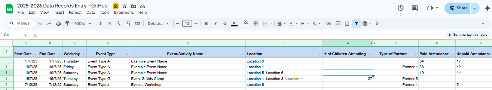
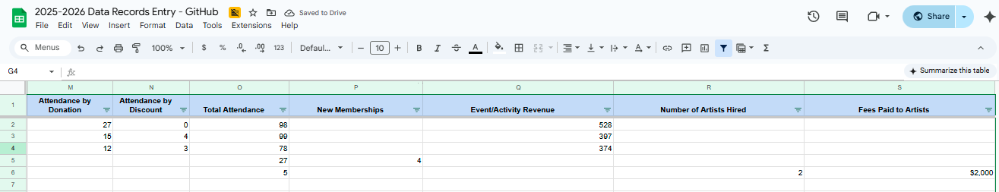

# 📁 Data Entry Automation Templates for Operational Efficiency

This project showcases a set of Google Sheets templates I designed during my internship to improve and future-proof everyday business processes through structured, scalable, and efficient data entry systems.

## ✅ Objective
To reduce manual input errors, improve data consistency, and save time by creating intuitive and reusable templates that streamline daily workflows across teams.

## 🧰 Tools & Techniques
- **Google Sheets**: Dynamic tables, data validation, drop-downs, conditional formatting
- **Formulas**: `ARRAYFORMULA`, `IF`, `VLOOKUP`, `IMPORTRANGE`, and more
- **Automation**: Basic Google Apps Script functions for custom triggers (where applicable)

## 🔍 Features
- Pre-built input structures with real-time data validation
- User-friendly interface for non-technical team members
- Templates adaptable across departments and future use cases
- Version-controlled and auditable format

## 🖼️ Previews
- Template Overview

- Validation & Protection Logic

## 🔗 Live Demo
[Click here to view the example Google Sheet (view only)](https://docs.google.com/spreadsheets/d/18uQnVkegN_wx8pye46UGYXVhewRmbEdVBosE07A5D7M/edit?usp=sharing)

> *Note: All data has been anonymized or mocked to protect sensitive information.*

## 📈 Impact
- Reduced manual errors by creating drop-down and validation controls
- Saved ~30% admin time through reusable templates
- Scalable format now used across multiple teams and departments for operational consistency

---
